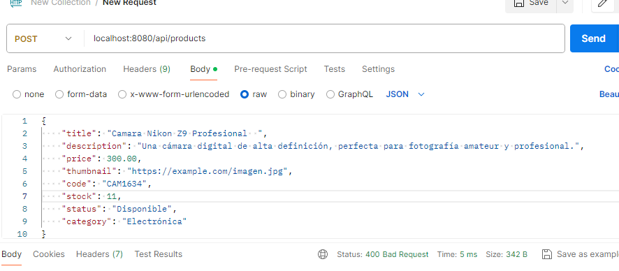
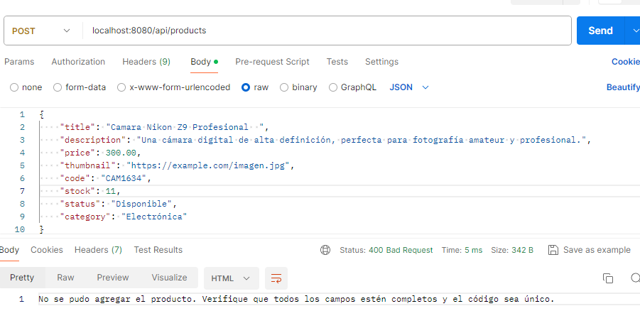
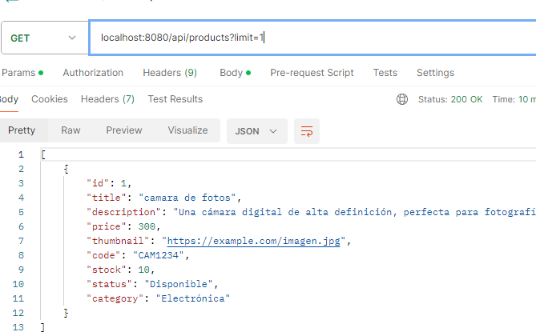
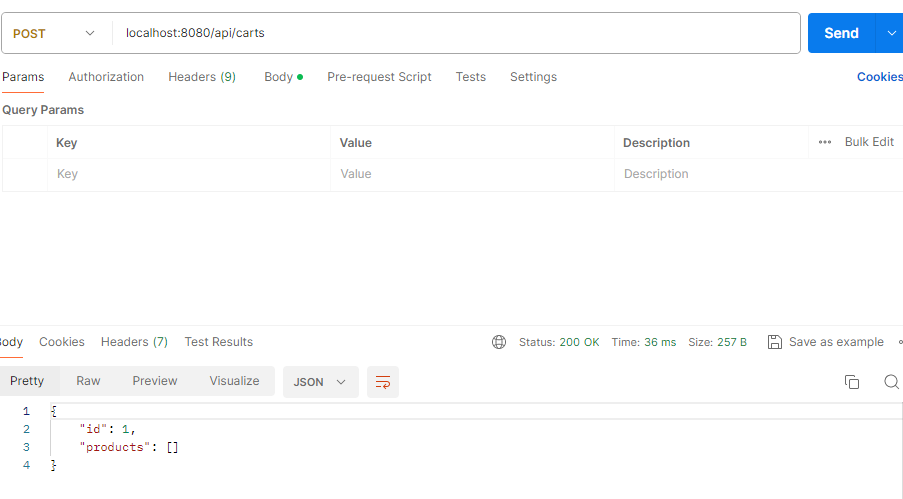
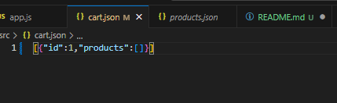
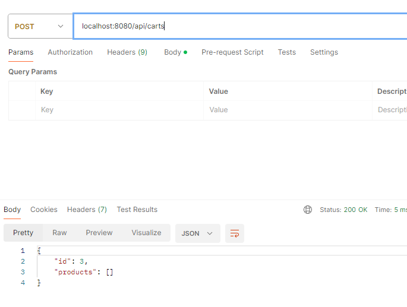
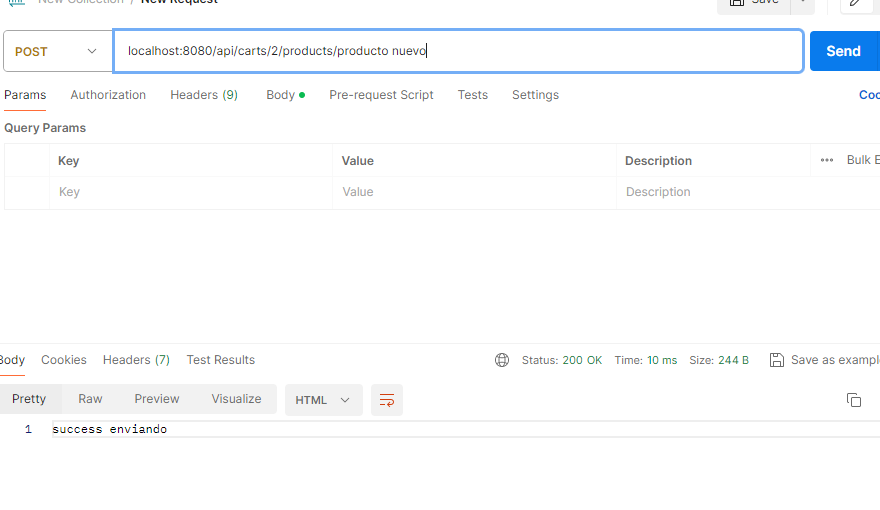
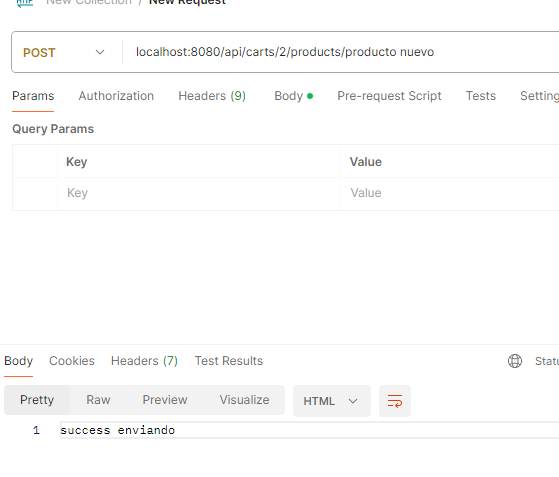
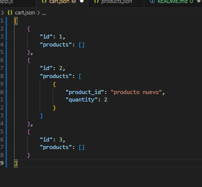
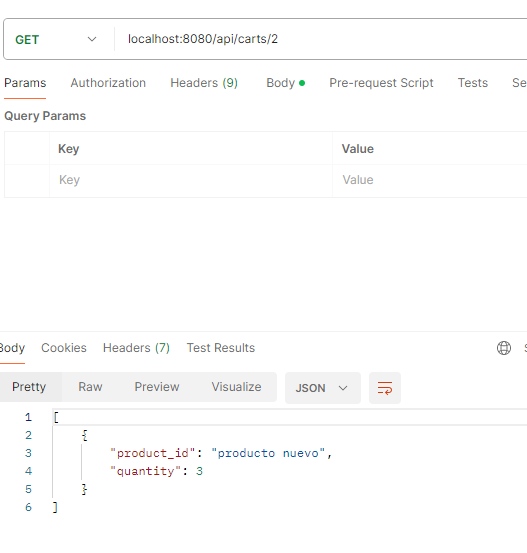

 # RUTA PRODUCTS
   ## METODO POST
- se agrega un producto con el metodo post, y se guarda en nuestros products.json

- se agrega otro producto y si quiero repetir la peticion, de agregar el mismo producto, no te deja por tener el mismo code

   ## METODO GET

- se obtienen todos los productos del carrito

- se obtiene un producto en especifico enviando su ID

### utilizamos limit con get

   ## METODO PUT

- se modifica el nombre del producto con ID 1 

    

   ## METODO DELETE

  - Se elimina el producto pasandole por parametro el ID 

 

  # RUTA CARTS
  ## METODO POST
- genero un carrito nuevo, que automaticamente se le coloca un ID del tipo number

- apreto send tres veces mas para crear tres carritos distintos, pero el ID se incrementa con cada carrito, generadon que cada uno tenga su propio ID 

- agrego un producto llamado "producto nuevo" al carrito con ID 2 

- si agrego el mismo producto, se incrementa la quantity

 ## METODO GET

 obtengo con el metodo GET el carrito con ID 2 y me muestra que contiene 3 cantidades de un producto.

 
